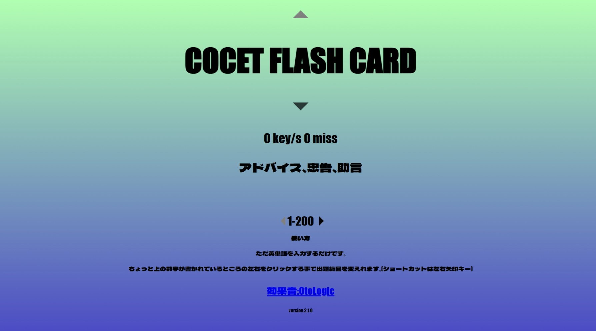
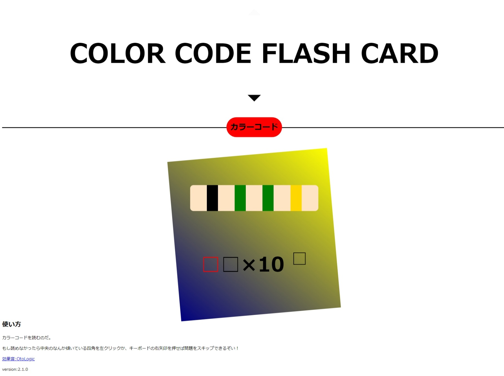
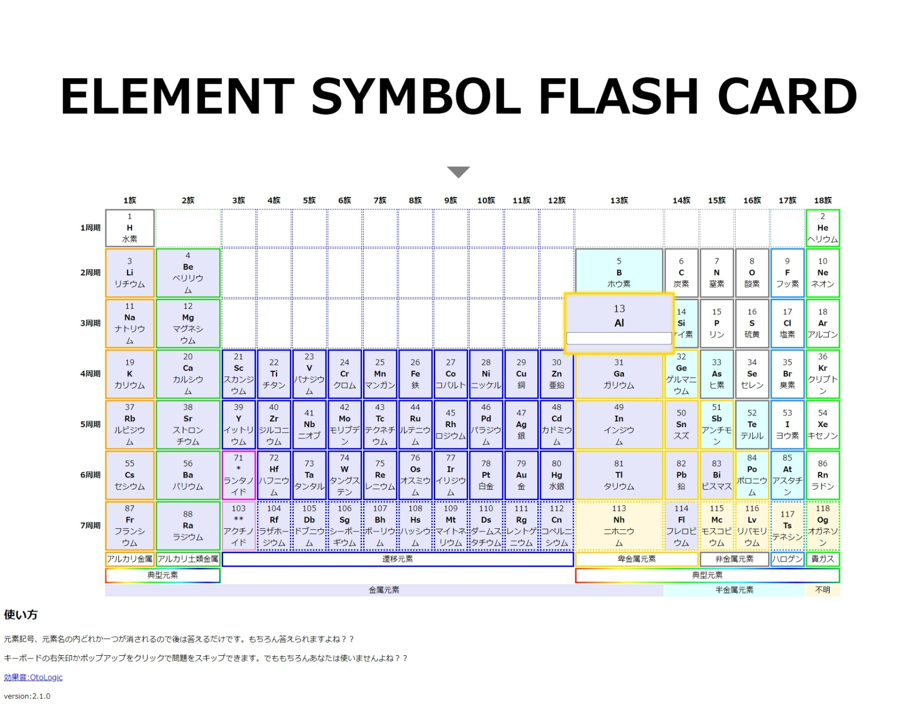

# COCET FLASH CARD

フラッシュカードどタイピング同時にできたら効率的じゃね？
という謎の理屈により誕生しました。
そしてなんかいろんな機能が付きました

## 機能
COCETフラッシュカード

カラーコードフラッシュカード

元素記号フラッシュカード

## 使い方:
見りゃわかる

## 注意事項:
スマホには対応していません。
そしてLinuxとmacOSは動作テストをしていません。
Windowsしか勝たん。
### 英語の読みがおかしいと思ったら
設定の「従来の音声を追加」で英語(米国)を追加してください。

## コードの中身を覗きたい人へ

[Svelte](https://svelte.jp/)と[Tauri](https://tauri.app/)で開発されています。

src/:プログラム本体

src/assets/:JSONファイルやmp3といったプログラムでないファイル

src-tauri/:Tauriの設定とか

Svelteって楽しいね(=

### クレジット
効果音:[OtoLogic](https://otologic.jp/)

フォント:[Dela Gothic One (Google fonts)](https://fonts.google.com/specimen/Dela+Gothic+One)